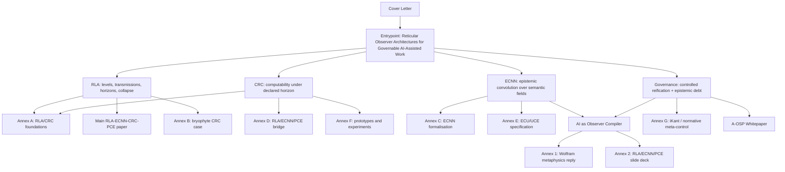

# RLA-ECNN / ROA Corpus

**Entrypoint:** `Reticular Observer Architectures for Governable AI-Assisted Work`

This repository is a compact research corpus on **reticular observer architectures**: AI-assisted systems whose outputs are not treated as isolated answers, but as the result of explicit, bounded, auditable epistemic structures.

The core move is simple:

```text
prompt -> answer                         # weak pattern
bounded material -> observer structure -> typed artefacts -> validation -> proof / witness / review / governance
```

The framework does **not** claim a completed mathematical theory, empirical validation, legal certification, production readiness, or artificial consciousness. It proposes a methodological and architectural discipline for making AI-assisted work reconstructable, horizon-relative, falsifiable, and governable.

---

## 1. Core thesis

Modern AI can generate fluent outputs, but in scientific, legal, technical, and organisational settings the hard problem is usually not fluency. It is:

- what evidence supports the output;
- which transformations occurred;
- which distinctions were collapsed;
- which labels were induced;
- which objects were reified;
- which claims remain unknown, contradictory, unsupported, or outside scope;
- whether the result is merely generated, reviewed, witnessed, approved, or proof-grade.

The corpus answers with a four-layer stack:

```text
RLA  -> structural grammar
CRC  -> computability discipline under a declared horizon
ECNN -> epistemic convolution over semantic / artefactual fields
ROA  -> governance layer: reification, debt, proof state, terminal states
```

The central contribution of the entrypoint paper is **controlled reification + epistemic debt propagation** as first-class, typed, auditable transitions. A pattern does not gain authority merely because it receives a label. When a label becomes a manipulable object, it incurs debt: validation state, provenance, allowed-use constraints, counterexamples, and rollback path must travel downstream with it.

---

## 2. Minimal vocabulary

| Term | Compressed meaning |
|---|---|
| **RLA** | Reticular Local Abstraction: models a domain as levels, languages, encodings, transmissions, horizons, and collapse policies. |
| **CRC** | Compact Reticular Computability: conditions under which a reticulum is computably operable under a declared epistemic horizon. |
| **CRC-basic** | Compact, computably operable reticulum under a horizon. |
| **CRC-strong** | CRC-basic plus Turing-like critical structure and non-trivial macro-emergence; supports undecidability-propagation arguments. |
| **ECNN** | Epistemic Convolutional Network / Method: CNN-inspired local-operator + pooling gesture generalized to semantic, legal, scientific, technical, narrative, graph, or artefactual fields. |
| **ECU / UCE** | Epistemic Computational Unit: bounded transducer constrained by an epistemic matrix, emitting structured artefacts, not oracle truth. |
| **ROA** | Reticular Observer Architecture: finite, horizon-relative architecture for producing and governing epistemic artefacts. |
| **Controlled reification** | Promotion of a pattern, relation, abstraction, or label into a manipulable object, only with trace, validation state, allowed use, and rollback. |
| **Epistemic debt** | Residual obligation created by unsupported transformations, missing provenance, unstable labels, modal drift, or unvalidated reification. |
| **Blocking debt** | Dischargeable state: an object may exist but must not be used downstream until review/evidence/escalation closes the obligation. |
| **Mandatory abstention** | Irreducible terminal state: the question must end in unknown or horizon-exceeded under the declared horizon. |
| **A-OSP** | Implementation witness: browser-native, text-first, proof-aware epistemic operating environment. |
| **iKant** | Normative meta-control pattern; a governance component, not a moral agent. |

---

## 3. Document hierarchy

```text
RLA-ECNN / ROA corpus
|
|-- ENTRYPOINT
|   `Reticular Observer Architectures for Governable AI-Assisted Work`
|   Purpose: defensible governance compression of the whole corpus.
|   Focus: controlled reification, epistemic debt propagation, mandatory abstention,
|          blocking debt, proof-aware AI-assisted work.
|
|-- THEORETICAL FOUNDATION
|   |-- `_Main_RLA-ECNN-CRC-PCE_paper_v1.pdf`
|   |   Purpose: conceptual manifesto for RLA, CRC, ECNN, ECU/UCE, and proto-consciousness conjecture.
|   |
|   |-- `annex_A_RLA-CRC_foundations_v1.pdf`
|   |   Purpose: formal core: levels, transmissions, epistemic horizons, IOA, EC, TC,
|   |            compact reticula, collapse/emergence metrics.
|   |
|   |-- `annex_C_ECNN_formalisation_v1.pdf`
|   |   Purpose: ECNN formalisation: CNN layers as reticular levels, epistemic head,
|   |            unknown/contradiction, training and falsifiability metrics.
|   |
|   |-- `annex_E_ECU-UCE_specification_v1.pdf`
|   |   Purpose: ECU/UCE specification: epistemic matrices, artefacts, deterministic
|   |            bounded transducers, LLM-based epistemic neurons under constraints.
|
|-- CASES, BRIDGES, EXPERIMENTS
|   |-- `annex_B_RLA_biological-case-bryophyte_v1.pdf`
|   |   Purpose: natural CRC case: compact RLA topology for a generalist bryophyte.
|   |
|   |-- `annex_D_RLA-ECNN_PCE-bridge_v1.pdf`
|   |   Purpose: bridge between RLA/CRC, ECNN, cellular automata, and Wolfram/PCE;
|   |            explicitly epistemic, not ontological.
|   |
|   |-- `annex_F_proto-epistemic-architectures_v1.pdf`
|   |   Purpose: prototype designs: bryophyte simulator, ECNN benchmarks, ECUs,
|   |            UCE orchestration, RLA-CA exploration, Popper-chi harness.
|   |
|   |-- `annex_G_methodology-experiments_v1.pdf`
|   |   Purpose: iKant / normative meta-controller: ethics-compliance layers,
|   |            world/self/norm state, governance outputs, challenge suites.
|
|-- OBSERVER / WOLFRAM LINE
|   |-- `AI as Observer Compiler - from Ruliad to RLA ECNN.docx`
|   |   Purpose: full observer-compiler synthesis: Ruliad as maximal horizon,
|   |            bounded observers, CRC-basic/strong, ECNN, reification debt,
|   |            Popper-chi, A-OSP, iKant.
|   |
|   |-- `ANNEX 1 - Reply_Wolfram_metaphisics_position_through_RLA_ECNN_lens.pdf`
|   |   Purpose: chapter-aligned reply to Wolfram using horizons, transmissions,
|   |            demarcation rule, operational objectivity, and A-OSP witness.
|   |
|   |-- `ANNEX 2 - RLA-ECNN_bridge_PCE_SlideDeck_Dec2025_v1.pdf`
|   |   Purpose: slide-deck version of the RLA/ECNN/PCE bridge.
|
|-- IMPLEMENTATION WITNESS
|   `3. Augmented Ontological Semantic Platform (A-OSP) Whitepaper - Webapp, Infrastructure, Runtime, Topology.docx`
|   Purpose: A-OSP as proof-aware, browser-native, text-first epistemic operating
|            environment: typed stripes, schema registry, EQL, bounded model calls,
|            proof contracts, Error Truth, authority matrices, app lenses, guards.
|
|-- SUBMISSION / ORIENTATION
|   |-- `RLA - Cover Letter.docx`
|   |-- `RLA - Cover Letter.pdf`
|   Purpose: submission-level orientation to the corpus, central question, annex roles,
|            programmatic status, and requested peer-review focus.
```

---

## 4. Mermaid map



---

## 5. Reading paths

| Reader | Path |
|---|---|
| **Fast orientation** | `Reticular Observer Architectures...` -> this README -> cover letter. |
| **Peer reviewer / editor** | `Reticular Observer Architectures...` -> Annex A -> Annex C -> Annex E -> Annex F. |
| **AI governance / compliance** | `Reticular Observer Architectures...` -> A-OSP whitepaper -> Annex G -> AI as Observer Compiler. |
| **Machine learning / neural-symbolic AI** | Annex C -> Annex E -> Annex F -> entrypoint paper. |
| **Philosophy of science / computability** | Main RLA-ECNN paper -> Annex A -> Annex D -> Wolfram reply. |
| **Biology / scientific modelling** | Annex B -> Main RLA-ECNN paper -> Annex A. |
| **Wolfram / Ruliad / PCE** | AI as Observer Compiler -> Wolfram reply -> Annex D -> slide deck. |
| **Implementation / product architecture** | A-OSP whitepaper -> entrypoint paper -> Annex F -> Annex G. |

---

## 6. End-to-end framework in one page

1. **Bounded observers** do not access total reality or total formal possibility. They stabilise local worlds by choosing horizons, languages, variables, encodings, measurements, collapse policies, validation rules, and terminal states.
2. **RLA** models this as a reticulum of levels and transmissions. A transmission can preserve distinctions, preserve them only on critical subsets, or collapse them.
3. **CRC** asks when such a reticulum is computably operable under a horizon. CRC-basic is the practical compactness tier; CRC-strong is the stronger tier where undecidability propagation and emergence claims become relevant.
4. **ECNN** generalises the convolutional gesture: scan a field, extract local patterns, pool/collapse information, induce candidate labels, and emit epistemic artefacts. The field may be visual, textual, legal, scientific, software, graph-based, or organisational.
5. **ECU/UCE** units are bounded epistemic transducers. They receive a local representation plus an epistemic matrix and emit structured artefacts: answer, confidence/strength, rationale, policies, unknown, contradiction, horizon-exceeded, review-required, or debt-open.
6. **Controlled reification** governs the moment when a pattern or label becomes an object: risk, control, claim, gap, scientific variable, legal issue, graph node, policy category, or kernel.
7. **Epistemic debt** records what remains unpaid after transformations: missing trace, information loss, unstable label, unvalidated object, modal drift, inference gap, scale-transfer error, or missing review.
8. **Debt propagation** is the governance analogue of undecidability propagation: unsupported distinctions propagate downstream unless discharged; non-injective collapse can block a formal limit but create debt if collapsed distinctions remain relevant.
9. **Terminal states** are explicit: answer, unknown, contradiction, horizon-exceeded, review-required, debt-open, blocked, or approved. A refusal can be a correct computation; a fluent unsupported answer can be an epistemic failure.
10. **A-OSP** shows one implementation path: source-of-truth as typed, append-only, diffable, read-backable artefact substrate; model calls are bounded processors, not owners of truth.
11. **iKant** shows one normative meta-control pattern: track world model, self model, normative kernel, epistemic history, local/global/critical artefacts, and human review boundaries.
12. **Popper-chi** is the falsification discipline: test unknown discipline, contradiction handling, horizon boundaries, modal drift, false reification, collapse traceability, provenance preservation, provider divergence, and downstream review effort.

---

## 7. Claim discipline

| Construct | Status | Safe formulation |
|---|---|---|
| ROA | Definition / thesis | Finite, horizon-relative architecture for producing and governing epistemic artefacts. |
| RLA | Formal grammar | Multi-level grammar of levels, languages, encodings, transmissions, and horizons. |
| CRC-basic | Formal-operational tier | Compact reticulum computably operable as a unit under a declared horizon. |
| CRC-strong | Stronger tier, partly open | CRC-basic plus Turing-like critical structure and macro-emergence; proof obligations remain. |
| ECNN | Design abstraction | CNN-inspired epistemic convolution, not necessarily a classical CNN. |
| ECU/UCE | Design pattern | Bounded transducer under matrix, prompt/schema/parser/validator/provenance constraints. |
| Controlled reification | Central governance concept | Pattern-to-object promotion with validation state, debt, allowed use, rollback. |
| D_reif(rate) | Minimal metric | Rate of downstream use of reified objects lacking authoritative validation. |
| Mandatory abstention | Structural terminal regime | Unknown/horizon-exceeded is required when the workflow question is undecidable under the horizon. |
| Blocking debt | Procedural terminal regime | Object exists but cannot be used downstream until debt is discharged. |
| A-OSP | Implementation witness | Implementability illustration, not independent empirical validation. |
| iKant | Normative meta-control | Computational governance pattern, not moral agency. |

---

## 8. Repository positioning

This corpus is best read as a **programmatic but criticisable research scaffold**. It is valuable if it lets reviewers, engineers, and researchers ask sharper questions:

- Which horizon is declared?
- Which distinctions are preserved or collapsed?
- Which candidate labels became objects?
- Which objects are validated, provisional, blocked, or rolled back?
- Which debt remains open?
- Which terminal state is epistemically mandatory?
- What is proof, what is projection, what is export, what is witness, and what is approval?

The final aim is not merely better AI answers. It is governance of the artificial observers through which answers are produced.

---

## 9. Suggested repository layout

```text
/docs
  /entrypoint
    Reticular Observer Architectures for Governable AI-Assisted Work.docx
  /theory
    _Main_RLA-ECNN-CRC-PCE_paper_v1.pdf
    annex_A_RLA-CRC_foundations_v1.pdf
    annex_C_ECNN_formalisation_v1.pdf
    annex_E_ECU-UCE_specification_v1.pdf
  /cases-bridges-experiments
    annex_B_RLA_biological-case-bryophyte_v1.pdf
    annex_D_RLA-ECNN_PCE-bridge_v1.pdf
    annex_F_proto-epistemic-architectures_v1.pdf
    annex_G_methodology-experiments_v1.pdf
  /observer-wolfram
    AI as Observer Compiler - from Ruliad to RLA ECNN.docx
    ANNEX 1 - Reply_Wolfram_metaphisics_position_through_RLA_ECNN_lens.pdf
    ANNEX 2 - RLA-ECNN_bridge_PCE_SlideDeck_Dec2025_v1.pdf
  /implementation-witness
    3. Augmented Ontological Semantic Platform (A-OSP) Whitepaper - Webapp, Infrastructure, Runtime, Topology.docx
  /submission
    RLA - Cover Letter.docx
    RLA - Cover Letter.pdf
```

---

## 10. Citation note

When citing the corpus, cite the entrypoint paper first, then cite individual annexes or implementation witnesses only for their local technical claims.

```bibtex
@misc{conte2026roa,
  author = {Gianluca Conte},
  title = {Reticular Observer Architectures for Governable AI-Assisted Work: A Reticular Framework for Epistemic Abstraction, Computability, and Proof-Aware Systems},
  year = {2026},
  note = {RLA-ECNN / ROA research corpus}
}
```
