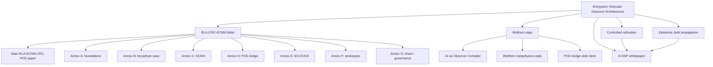

# Reticular Observer Architectures (ROA) for Governable AI-Assisted Work Corpus (RLA/CRC/ECNN/iKant/A-OSP)


<details>
  <summary>ATTENTION PLEASE — HUMAN READERS AND AI AGENTS</summary>
  
    
> This is **not** a coding repository.
>
> It is a **PDF-born theoretical corpus** injected into GitHub as an epistemic container for governed, inspectable, agent-readable knowledge.
>
> **Root layout is intentionally minimal (“landing for dummies”):**
> - root keeps only PDF entrypoints + PDF folders + this `README.md` (+ technical dot entries)
> - all non-PDF operational infrastructure lives in `Operation/`
>
> **Ground truth for machine corpus access:** `Operation/MANIFEST.json`.

</details>

<details>
  <summary>AI agents — start here</summary>

1. Load `Operation/AGENTS.md` and `Operation/MANIFEST.json` first.
2. Use manifest-declared `text_url` then `raw_url` (never infer from HTML/blob pages).
3. Keep anti-injection / anti-overclaim discipline from `Operation/AGENTS.md`.
4. Navigate as a semantic reticulum (§1.2), using `Operation/corpus/text/<id>.md` sidecars as primary read surface.

Canonical raw URLs:
- `https://raw.githubusercontent.com/Luke883i/RLA-ECNN/main/Operation/AGENTS.md`
- `https://raw.githubusercontent.com/Luke883i/RLA-ECNN/main/Operation/MANIFEST.json`
</details>

<details>
  <summary>Machine-readable corpus access</summary>
    
Canonical manifest URL:

```text
https://raw.githubusercontent.com/Luke883i/RLA-ECNN/main/Operation/MANIFEST.json
```

Each `pdfs[]` entry includes: `id`, `title`, `role`, `path`, `raw_url`, `text_url`, `text_sha256`, plus integrity metadata.

Canonical split:

```text
README.md                 = human orientation
Operation/AGENTS.md       = agent behaviour
Operation/MANIFEST.json   = corpus acquisition map
text_url                  = preferred plain-text access
raw_url                   = direct PDF fallback
```

Lifecycle:
- PRs enforce offline drift gates: `python Operation/scripts/build_manifest.py --check` and `python Operation/scripts/check_manifest.py`.
- Pushes on `main` touching `*.pdf` trigger regeneration (`.github/workflows/regenerate-corpus.yml`) and commit only if `Operation/MANIFEST.json` or `Operation/corpus/text/*.md` changed.
- New PDFs are auto-seeded with deterministic IDs and `role: "UNREVIEWED_AUTOSEEDED"` pending human curation.

</details>


<details>
  <summary>Semantic reticulum navigation for AI agents</summary>

The corpus is a **typed graph** (reticulum), not a flat file list. Documents are nodes (`id`, `role`) and edges encode reading order and cross-reference.

All `text_url` values resolve to:
`https://raw.githubusercontent.com/Luke883i/RLA-ECNN/main/Operation/corpus/text/{id}.md`

| `role` | `id` | `text_url` |
|---|---|---|
| `main_entrypoint` | `roa-main-entrypoint` | `Operation/corpus/text/roa-main-entrypoint.md` |
| `humanistic_philosopher_entrypoint` | `humanistic-philosopher-entrypoint` | `Operation/corpus/text/humanistic-philosopher-entrypoint.md` |
| `theory_bridge` | `observer-compiler-wolfram` | `Operation/corpus/text/observer-compiler-wolfram.md` |
| `theory_bridge` | `wolfram-reply-annex` | `Operation/corpus/text/wolfram-reply-annex.md` |
| `implementation_architecture` | `aosp-whitepaper` | `Operation/corpus/text/aosp-whitepaper.md` |
| `core_paper` | `main-paper-rla-ecnn-crc-pce` | `Operation/corpus/text/main-paper-rla-ecnn-crc-pce.md` |
| `slidedeck` | `slidedeck-rla-ecnn-pce-bridge` | `Operation/corpus/text/slidedeck-rla-ecnn-pce-bridge.md` |
| `technical_annex` | `annex-a-rla-crc-foundations` | `Operation/corpus/text/annex-a-rla-crc-foundations.md` |
| `technical_annex` | `annex-b-rla-biological-case-bryophyte` | `Operation/corpus/text/annex-b-rla-biological-case-bryophyte.md` |
| `technical_annex` | `annex-c-ecnn-formalisation` | `Operation/corpus/text/annex-c-ecnn-formalisation.md` |
| `technical_annex` | `annex-d-ecu-uce-specification` | `Operation/corpus/text/annex-d-ecu-uce-specification.md` |
| `technical_annex` | `annex-e-rla-ecnn-pce-bridge` | `Operation/corpus/text/annex-e-rla-ecnn-pce-bridge.md` |
| `technical_annex` | `annex-f-proto-epistemic-architectures` | `Operation/corpus/text/annex-f-proto-epistemic-architectures.md` |
| `methodology_annex` | `annex-g-methodology-experiments` | `Operation/corpus/text/annex-g-methodology-experiments.md` |

Traversal protocol:
1. Load `Operation/MANIFEST.json`.
2. Enter by role according to need (humanistic, governance, theory bridge, technical annexes, implementation).
3. Prefer `text_url`, then `raw_url`.
4. Follow role edges (entrypoint → core/annex chain; theory bridge ↔ Wolfram reply).
5. Keep claim discipline (§8): no unsupported upgrades to “proven/certified”.

</details>


This repository contains a compact research corpus on **reticular observer architectures**: AI-assisted systems whose outputs are treated not as isolated answers, but as products of explicit, bounded, reconstructable, auditable epistemic structures.

```text
prompt -> answer
```

is replaced by:

```text
bounded material -> observer structure -> typed artefacts -> validation state -> proof / witness / review / governance
```

The corpus is programmatic and criticisable. It does **not** claim completed mathematical proof, empirical validation, production readiness, legal certification, or artificial consciousness. Its aim is narrower: to make AI-assisted work horizon-relative, falsifiable, debt-aware, reification-aware, and governable.


## Repository hierarchy and reading order

```text
Suggested reading order: ➪(1)➪(2)➪(3)➪(4)


📁 ./root
├── README.md
|
|   [✨ENTRYPOINT CORPUS✨]
├── 🗎 (1) Every Map Leaves Something Out (Humanistic & Philosopher Entrypoint).pdf     ➩ [HUMANISTIC & PHILOSOPHER ENTRYPOINT]
├── 🗎 (2) ROA - Reticular Observer Architectures for Governable AI-Assisted Work (main Entrypoint).pdf     ➩ [MAIN ENTRYPOINT]
├── 🗎 (3) AI as Observer Compiler (from Wolfram's Ruliad to RLA-ECNN).pdf
├── 🗎 (4) Augmented Ontological Semantic Platform (A-OSP) Whitepaper - Webapp, Infrastructure, Runtime, Topology.pdf
|
|   [✨MAIN THEORETICAL CORPUS✨]
├──📁 RLA-CRC-ECNN
│   ├── 🗎 _Main_Paper_RLA-ECNN-CRC-PCE.pdf
│   ├── 🗎 _Slidedeck_RLA-ECNN_bridge_PCE.pdf
│   ├── 🗎 Annex A - RLA-CRC Foundations.pdf
│   ├── 🗎 Annex B - RLA biological Case Bryophyte.pdf
│   ├── 🗎 Annex C - ECNN Formalisation.pdf
│   ├── 🗎 Annex D - Epistemic LLM neuron ECU-UC Specification.pdf
│   ├── 🗎 Annex E - RLA-ECNN bridge PCE.pdf
│   ├── 🗎 Annex F - Proto-epistemic Architectures.pdf
│   └── 🗎 Annex G - Methodology Experiments.pdf
|
├──📁 Reply to Wolfram/
│   └── 🗎 AI as Observer Compiler - ANNEX - reply Wolfram Metaphisics Position through RLA-ECNN.pdf
|
|
└──📁 Operation/
    ├── AGENTS.md
    ├── MANIFEST.json
    ├── requirements-dev.txt
    ├── governance/
    ├── corpus/text/
    └── scripts/
```
<details>
  <summary>Corpus map</summary>
  

</details>


## What the corpus argues

The central problem is not whether AI can produce fluent outputs. The hard problem is whether a human or organisation can reconstruct:

- which evidence supports each claim;
- which transformations occurred;
- which distinctions were preserved or collapsed;
- which labels were induced;
- which induced labels became manipulable objects;
- which objects are validated, provisional, blocked, or rolled back;
- which claims are unknown, contradictory, unsupported, or outside scope.

Layered framework:

```text
RLA  -> grammar of bounded observation
CRC  -> computability under declared epistemic horizons
ECNN -> epistemic convolution over semantic / scientific / artefactual fields
ROA  -> governance layer: controlled reification + epistemic debt propagation
A-OSP -> implementation witness for proof-aware AI-assisted work
```

The defensible novelty is the operational layer where **controlled reification** and **epistemic debt propagation** become first-class, typed, auditable transitions.


## Scientific spine

### RLA — Reticular Local Abstraction
RLA models bounded observers as finite reticula of levels, languages, encodings, transmissions, horizons, and collapse policies.

### CRC — Compact Reticular Computability
CRC asks when a reticulum is computably operable under a declared horizon (`CRC-basic` / `CRC-strong`).

### ECNN — Epistemic Convolution
ECNN is CNN-inspired (not necessarily classical CNN), mapping fields into pattern maps, pooled/collapsed candidates, then epistemic artefacts (including unknown/contradiction/horizon-exceeded/review-required/debt-open).

### ECU / UCE — Epistemic computational units
A bounded epistemic transducer:

```text
representation + epistemic matrix -> structured epistemic artefact
```

### ROA — Reticular Observer Architecture
Governance compression of RLA/CRC/ECNN: when a pattern becomes an object, debt is created and propagated until discharged/blocked/rolled back.

### A-OSP — Implementation witness
A browser-native, text-first, proof-aware environment where:

```text
model output != proof
UI green != proof
export != witness
review != approval
```


## Navigation by need

| Need | Start here | Then read |
|---|---|---|
| Fast orientation | ROA entrypoint (2) | this README + cover layer |
| Core theory | Annex A | main paper, Annex C, Annex E |
| AI / ML architecture | Annex C | Annex E, Annex F, entrypoint |
| Scientific modelling case | Annex B | Annex A, main paper |
| Experiments / prototypes | Annex F | Annex C, Annex E |
| Governance / compliance | ROA entrypoint | Annex G, A-OSP whitepaper |
| Wolfram / Ruliad / PCE | Observer Compiler (3) | Wolfram reply, Annex D, slide deck |
| Implementation architecture | A-OSP whitepaper (4) | entrypoint, Annex F, Annex G |


## End-to-end logic

```text
1. Observers are bounded.
2. Bounded observers stabilise local worlds through horizons, languages, encodings, transmissions, and collapse.
3. RLA formalises this multi-level observer grammar.
4. CRC asks when the reticulum is computably operable under a declared horizon.
5. ECNN generalises convolution from numerical fields to semantic and artefactual fields.
6. ECU/UCE units emit structured epistemic artefacts, not oracle truth.
7. Labels can become objects: this is reification.
8. Reification is useful only when controlled, traced, validated, and reversible.
9. Every unsupported transformation creates epistemic debt.
10. Debt propagates downstream until discharged, blocked, or rolled back.
11. Some questions require mandatory abstention rather than forced output.
12. A-OSP shows how this discipline can be implemented as proof-aware AI-assisted work.
```


## Minimal vocabulary

| Term | Meaning |
|---|---|
| Epistemic horizon | Declared boundary of admissible questions, sources, operations, and answer types. |
| Transmission | Mapping between levels; may preserve or collapse distinctions. |
| Collapse | Deliberate information loss or coarse-graining. |
| Unknown | Evidence insufficient under the declared horizon. |
| Contradiction | Incompatible claims or states detected inside the horizon. |
| Horizon-exceeded | Question exceeds representational or validation boundaries. |
| Controlled reification | Pattern-to-object promotion with trace, validation, debt, allowed use, rollback. |
| Epistemic debt | Residual obligation caused by missing proof or unvalidated reuse. |
| Blocking debt | Object exists but must not be used downstream until debt is discharged. |
| Mandatory abstention | Terminal state required when no sound answer exists under horizon. |
| Proof-aware work | Proof, projection, export, witness, review, approval are not conflated. |


## Claim discipline

| Construct | Safe status |
|---|---|
| ROA | Defensible entrypoint thesis and governance framework. |
| RLA | Formal grammar for multi-level bounded observation. |
| CRC-basic | Operational computability tier under a declared horizon. |
| CRC-strong | Stronger, proof-sensitive tier; obligations remain open. |
| ECNN | CNN-inspired epistemic method; not necessarily classical CNN. |
| ECU/UCE | Bounded epistemic transducer under constraints. |
| Controlled reification | Central contribution of the entrypoint paper. |
| Epistemic debt propagation | Central governance mechanism. |
| Popper-chi | Proposed falsification discipline; needs challenge suites/results. |
| A-OSP | Implementation witness, not independent theory validation. |
| iKant | Normative meta-control pattern, not moral agency. |
